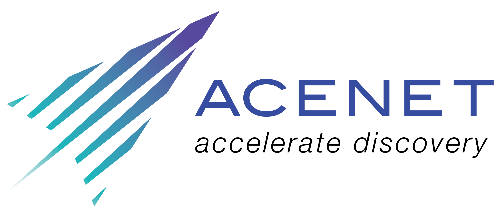

# Tools of the Trade 2021-2022 
## Bringing Research into the Classroom
---
Tool of the Trade is a lunchtime series on the last Friday of each month, by Researchers for Researchers, in collaboration with ACENET. The idea is to share knowledge and make connections with and between researchers in Atlantic Canada, who are interested in or are already using digital tools in their research. The theme for the upcoming academic year is *Bringing Research into the Classroom*. We will be sharing methods and resources for introducing digital research projects to students, highlighting opporutnities for student and faculty training in digital skills, and facilitating discussions and conversations around how we can ethically and sustainably equip faulty, students, and research teams as they navigate a complex and rapidly changing digital world.

---
## Schedule for the 2021-2022 Academic Year
- [Atlantic Digital Opportunities Fair](september) September 24, 12:00-1:00 pm AT
Featuring appearences from:
  - St.FX Digital Humanities Centre, host of DHSI-East 
  - Atlantic OER Grant Recipient 
  - CAUL RDM series 
  - ACENET Training Coordinator
  - Sound Communities, host of Digital Techniques in Film Summer School  
- [Tools for Facilitating Training of Your Research Team, Dr. Catherine Mah](october) October 29, 12:00 AT 
- [Incorporating a Digital Research Assignment into Your Humanities or Social Sciences Course, Dr. Laura Estill](november) November 26, 12:00-1:00 pm AT
- [Exploring a Premodern City: Locative Smartphone Apps & Digital Pedagogies](january) January 28, 12:00-1:00 pm AT
- [TBD](march) March 25, 12:00-1:00 pm AT

---
## Details and Registration
Click the link below to reigster. Sessions are hosted online with Zoom, you will recieve the connection details via email the morning of each session.   
[Registration Link](https://docs.google.com/forms/d/e/1FAIpQLSeNNhwN8zg5t832o0GQQA53UB8iJnm_-o7OJ8PsIPQm3pX3tg/viewform?usp=sf_link)

---
## Contact Us
Should have any questions about the series, or issues with registration please contact:  
**Lydia Vermeyden**  
Email: lydia.vermeyden@ace-net.ca  
Phone: (902) 867-5712

---
[This should take to the second page](digital_fair)
